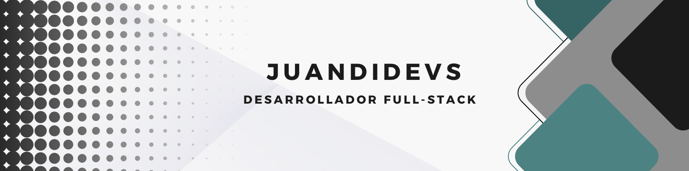

# Juan Diego Ayllón Parra

## _Desarrollador Full-Stack y Amante de la Tecnología_

Hola, mi nombre es Juan Diego y soy desarrollador full-stack. Este es mi espacio donde muestro y comparto mis ideas y proyectos en el mundo del desarrollo.

## _Acerca del Repositorio_

En este repositorio, encontrarás todo lo relacionado con el código fuente de mis proyectos y mi evolución como Desarrollador Full-Stack

### _Tecnologías_
---

 
 
 

- Frontend: HTML, CSS, JavaScript, TypeScript, React, Astro, Angular, Vue.js
- Backend: SQL, Django, Streamlit, Java, Rust, Node.js
- Otros: Python, C#

### _Algunos de mis proyectos_
---

<table>
    <tr>
        <td width="50%">
            <h3>Api Cat Gallery</h3>
            
            
Proyecto realizado con vite y vanilla javascript que consume The Cat API para mostrar una galería interactiva de gatos, permitiendo filtrar resultados, cargar más imágenes y gestionar favoritos mediante localStorage.

        </td>
        <td width="50%">
            <h3>Proyecto 2</h3>
            
            
Descripción P2

        </td>
    </tr>
    <tr>
        <td width="50%">
            <h3>Proyecto 3</h3>
            
            
Descripción P3

        </td>
        <td width="50%">
            <h3>Proyecto 4</h3>
            
            
Descripción P4

        </td>
    </tr>
</table>

### _Contáctame_
---

Si tienes alguna duda o sugerencia no dudes en contactar conmigo:

  
  

Gracias por visitar mi repositorio.

